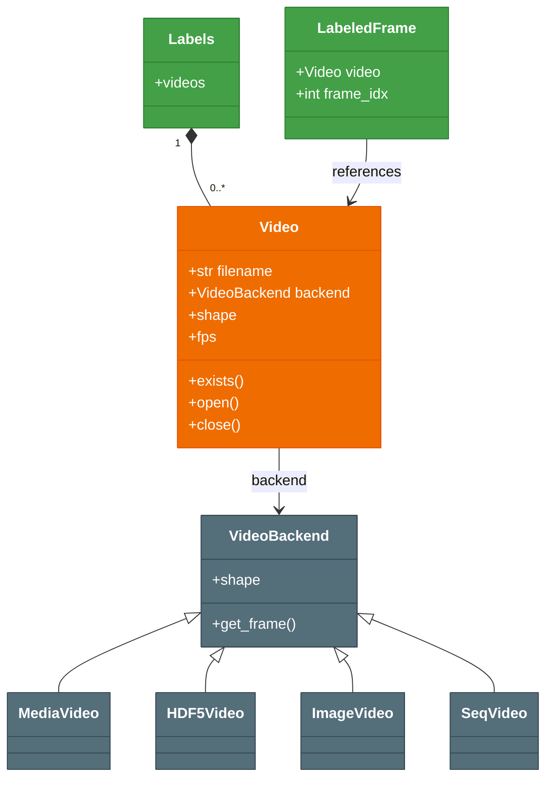

# Video

The [`Video`][sleap_io.Video] class provides a lazy, array-like interface to video data. It wraps various backends (MP4, AVI, HDF5, image sequences, Norpix .seq) behind a unified API, enabling frame access with NumPy-style indexing regardless of the underlying storage format.

- **Unified interface**: `Video` wraps different backends (MP4/AVI via ffmpeg, HDF5, image sequences, Norpix .seq) behind a single numpy-like indexing API, with the backend auto-detected from the file extension.
- **Lazy access**: Frames are only read from disk when you index into the video — creating a `Video` object does not load any pixel data.
- **Label integration**: Each [`LabeledFrame`](labels.md) references a `Video` and a frame index, linking pose annotations back to the underlying footage.

## Creating videos

The most common way to create a video is from a filename. The backend is automatically selected based on the file extension:

```python
video = sio.load_video("test.mp4")
# or
video = sio.Video.from_filename("test.mp4")
```

You can also create a minimal `Video` object without opening a backend. This is useful when you need to reference a video file that may not be available on the current system:

```pycon
>>> import sleap_io as sio
>>> video = sio.Video("experiment.mp4", open_backend=False)
>>> print(video.filename)
```

For image sequences, pass a list of filenames:

```python
video = sio.Video(filename=["frame_000.png", "frame_001.png", "frame_002.png"])
```

You can also point to a directory of images, which will be automatically expanded:

```python
video = sio.Video.from_filename("path/to/frames/")
```

## Accessing frames

`Video` supports array-like indexing to read frames as NumPy arrays:

```python
frame = video[0]          # First frame as numpy array
frame.shape               # (height, width, channels)

frames = video[0:10]      # Slice of frames
frames.shape              # (10, height, width, channels)

video.shape               # (n_frames, height, width, channels)
len(video)                # Number of frames
```

If the backend is not yet open (e.g., when `open_backend=False`), accessing a frame will automatically open the backend if the file exists:

```python
video = sio.Video("test.mp4", open_backend=False)
frame = video[0]  # Backend opens automatically on first access
```

## Video properties

| Property | Type | Description |
|----------|------|-------------|
| `filename` | `str \| list[str]` | Path to the video file, or list of image paths for image sequences |
| `shape` | `tuple[int, int, int, int] \| None` | `(n_frames, height, width, channels)`, or `None` if unavailable |
| `backend` | `VideoBackend \| None` | The underlying reader object |
| `is_open` | `bool` | Whether the backend is open and the file exists |
| `fps` | `float \| None` | Frames per second (from container metadata for media files) |
| `grayscale` | `bool \| None` | Whether the video has a single channel |
| `source_video` | `Video \| None` | The source video for embedded/proxy videos |

The `fps` property can also be set, which is useful for backends that do not store frame rate information (e.g., image sequences):

```python
video.fps = 30.0
```

Time conversion helpers are available when FPS is known:

```python
video.fps = 30.0
video.frame_to_seconds(150)   # 5.0
video.seconds_to_frame(5.0)   # 150
```

## Backends

The `Video` class delegates frame reading to a backend that matches the file type:

| Backend | Formats | Description |
|---------|---------|-------------|
| `MediaVideo` | MP4, AVI, MOV, MJ2, MKV | Standard video files via imageio/ffmpeg, OpenCV, or PyAV |
| `HDF5Video` | H5, HDF5, SLP | Frames stored as datasets in HDF5 files |
| `ImageVideo` | PNG, JPG, JPEG, TIF, TIFF, BMP | Ordered sequences of image files |
| `SeqVideo` | SEQ | Norpix .seq high-speed video files (StreamPix) |

The full list of supported extensions is available via `Video.EXTS`:

```pycon
>>> import sleap_io as sio
>>> print(sio.Video.EXTS)
```

!!! info "Norpix `.seq` extras"
    The `SeqVideo` backend exposes per-frame timestamps and an auto-computed FPS derived from the timestamp stream (handy when the header FPS is wrong, as is common for high-speed recordings):

    ```python
    video = sio.load_video("recording.seq")
    seq = video.backend   # SeqVideo
    print(seq.fps)                  # auto-computed from timestamps
    ts = seq.get_timestamps()       # seconds-since-epoch, shape (num_frames,)
    ```

    `sio show recording.seq` surfaces the Norpix header (codec, bit depth, description, FPS), and `sio reencode recording.seq -o recording.mp4` uses the Python path to transcode.

For media videos, you can choose which reading plugin to use:

```python
# Set per-video
video.set_video_plugin("opencv")

# Or set a global default
sio.set_default_video_plugin("FFMPEG")
```

Available plugins and their aliases:

| Plugin | Aliases |
|--------|---------|
| `opencv` | `"opencv"`, `"cv"`, `"cv2"`, `"ocv"` |
| `FFMPEG` | `"FFMPEG"`, `"ffmpeg"`, `"imageio-ffmpeg"`, `"imageio_ffmpeg"` |
| `pyav` | `"pyav"`, `"av"` |

## Embedded videos

When [`Labels`](labels.md) are saved as `.pkg.slp` files with embedded frames, the video data is stored inside the HDF5 file. In this case, the `Video` will have an `HDF5Video` backend pointing to the embedded dataset, and the `source_video` attribute will reference the original video:

```python
labels = sio.load_slp("labels.pkg.slp")
video = labels.videos[0]

# The embedded video points to the .pkg.slp file
video.filename   # "labels.pkg.slp"
video.backend    # HDF5Video

# The original video path is preserved
video.source_video.filename  # "original_recording.mp4"

# Traverse the full provenance chain
video.original_video  # Root video in the chain
```

This provenance chain enables restoring original video paths when extracting labels from packaged files.

## File management

### Checking existence

```python
video.exists()                    # Check if file is accessible
video.exists(check_all=True)      # For image sequences, check all files
video.exists(dataset="video0")    # For HDF5, check specific dataset
```

### Opening and closing

```python
video.open()                      # Open backend for reading
video.close()                     # Close backend and free resources
video.open(plugin="opencv")       # Reopen with a different plugin
```

The `open` and `close` methods remember backend settings (dataset, grayscale, plugin) across cycles.

### Replacing filenames

```python
video.replace_filename("/new/path/to/video.mp4")  # Updates and reopens
video.replace_filename("/new/path.mp4", open=False)  # Update without opening
```

### Saving to a new file

```python
new_video = video.save("output.mp4")                # Save all frames
new_video = video.save("clip.mp4", frame_inds=[0, 10, 20])  # Save specific frames
new_video = video.save("output.mp4", fps=60)         # Override output FPS
```

## Supported formats

| Extension | Backend | Description |
|-----------|---------|-------------|
| `.mp4` | `MediaVideo` | MPEG-4 video |
| `.avi` | `MediaVideo` | Audio Video Interleave |
| `.mov` | `MediaVideo` | QuickTime movie |
| `.mj2` | `MediaVideo` | Motion JPEG 2000 |
| `.mkv` | `MediaVideo` | Matroska video |
| `.h5`, `.hdf5` | `HDF5Video` | HDF5 dataset |
| `.slp` | `HDF5Video` | SLEAP labels with embedded frames |
| `.png` | `ImageVideo` | PNG image sequence |
| `.jpg`, `.jpeg` | `ImageVideo` | JPEG image sequence |
| `.tif`, `.tiff` | `ImageVideo` | TIFF image sequence |
| `.bmp` | `ImageVideo` | BMP image sequence |
| `.seq` | `SeqVideo` | Norpix .seq high-speed video (StreamPix) |

## Class diagram



!!! note "See also"
    - [Labels & Frames](labels.md): How videos are referenced by labeled frames
    - [Examples](../examples.md#video-operations): Practical video operation examples

## API reference

::: sleap_io.Video
