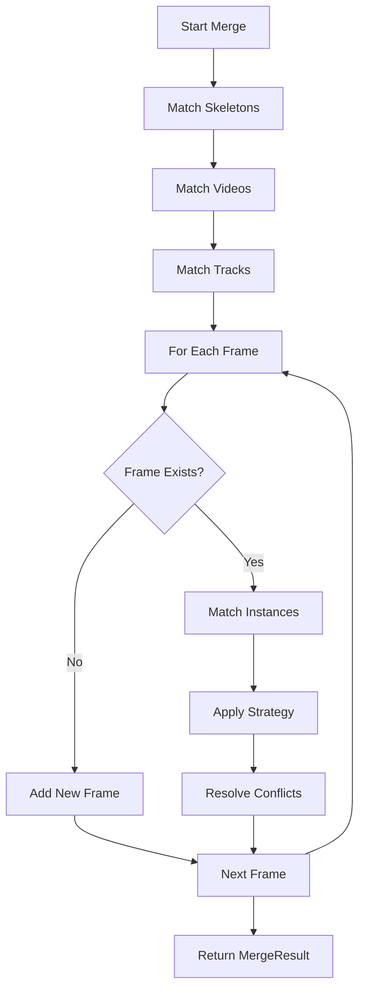

# Merging annotations

The merging system in sleap-io provides powerful tools for combining multiple annotation files while intelligently handling conflicts, duplicates, and different data sources. This is essential for collaborative annotation, human-in-the-loop workflows, and consolidating predictions from multiple models.

!!! info "Key concepts"
    
    - **Merging**: Combining annotations from multiple sources into a single dataset
    - **Matching**: Determining which objects (skeletons, videos, tracks, instances) correspond between datasets
    - **Conflict resolution**: Handling overlapping or contradicting annotations using configurable strategies
    - **Provenance tracking**: Automatic recording of merge history and data sources

## Quick start

The simplest and most common use case is merging predictions back into a manually annotated project:

```python title="Basic merge example" linenums="1"
import sleap_io as sio

# Load your manual annotations and new predictions
base_labels = sio.load_file("manual_annotations.slp")
predictions = sio.load_file("model_predictions.slp")

# Merge predictions into base project
# Default 'smart' strategy preserves manual labels
result = base_labels.merge(predictions)

# Check what happened
print(f"Frames merged: {result.frames_merged}")
print(f"Instances added: {result.instances_added}")

# Save the merged project
base_labels.save("merged_project.slp")
```

!!! tip
    The default `smart` strategy automatically preserves your manual annotations while adding new predictions, making it ideal for human-in-the-loop workflows.

## How merging works

The merge process follows a systematic approach to combine data structures while maintaining consistency:



### Step-by-step process

1. **Skeleton matching**: Identifies corresponding skeletons between datasets based on node names and structure
2. **Video matching**: Determines which videos represent the same source data (handles different paths, formats)
3. **Track matching**: Maps tracks (instance identities) between datasets
4. **Frame merging**: For each frame, applies the chosen strategy to combine instances
5. **Conflict resolution**: Handles overlapping instances according to the selected strategy

## Merging strategies

The merge strategy determines how instances are combined when frames overlap. Each strategy is designed for specific workflows and requirements.

### Smart strategy (default)

Intelligently preserves manual annotations while updating predictions. This is the recommended strategy for most use cases.

??? abstract "Algorithm details"
    
    ```python title="Smart merge logic (simplified)" linenums="1"
    def smart_merge(base_frame, new_frame):
        merged = []
        
        # Step 1: Always keep user labels from base
        for instance in base_frame:
            if isinstance(instance, Instance):  # User label
                merged.append(instance)
        
        # Step 2: Find spatial matches between frames
        matches = find_spatial_matches(base_frame, new_frame)
        
        # Step 3: Process each match
        for base_inst, new_inst in matches:
            if both_are_user_labels:
                keep(base_inst)  # Preserve original
            elif base_is_user_label:
                keep(base_inst)  # User labels always win
            elif new_is_user_label:
                keep(new_inst)   # New user label replaces prediction
            else:  # Both are predictions
                keep(higher_score_instance)
        
        # Step 4: Add unmatched instances from new frame
        merged.extend(unmatched_new_instances)
        
        return merged
    ```

!!! example "When to use"
    
    - Merging model predictions into manually annotated projects
    - Updating predictions while preserving validated annotations
    - Human-in-the-loop training workflows

```python title="Using smart strategy"
result = base_labels.merge(new_labels, frame_strategy="smart")
```

**Behavior matrix:**

| Base frame              | New frame               | Result           | Reasoning                               |
| ----------------------- | ----------------------- | ---------------- | --------------------------------------- |
| User label              | Prediction              | User label       | Manual annotations are preserved        |
| User label              | User label              | Base user label  | Avoid duplicates, keep original         |
| Prediction              | User label              | User label       | Manual corrections override predictions |
| Prediction (score: 0.8) | Prediction (score: 0.9) | Prediction (0.9) | Higher confidence wins                  |
| Empty                   | Any                     | New instance     | Add missing annotations                 |

### Keep original strategy

Preserves all instances from the base dataset, ignoring new instances at matching positions.

!!! example "When to use"
    
    - Protecting validated datasets from modification
    - Reviewing changes without applying them
    - Maintaining data integrity for published datasets

```python title="Using keep original strategy"
result = base_labels.merge(new_labels, frame_strategy="keep_original")
```

### Keep new strategy

Replaces matched instances with new ones, effectively updating the base dataset.

!!! example "When to use"
    
    - Completely replacing old predictions with new ones
    - Applying corrections from a revised annotation pass
    - Updating with higher quality annotations

```python title="Using keep new strategy"
result = base_labels.merge(new_labels, frame_strategy="keep_new")
```

### Keep both strategy

Retains all instances from both datasets without filtering duplicates.

!!! warning
    This strategy can create overlapping instances at the same locations. Use with caution and consider post-processing to remove duplicates.

!!! example "When to use"
    
    - Combining annotations from multiple annotators
    - Preserving all data for later review
    - Creating training data with augmented annotations

```python title="Using keep both strategy"
result = base_labels.merge(new_labels, frame_strategy="keep_both")
```

### Update tracks strategy

Updates the track assignments and tracking scores of existing instances based on spatial matches with new instances, while preserving the original pose annotations.

This strategy preserves the original pose data and **does not** add new or remove existing instances!

!!! example "When to use"
    
    - Updating track identities after running a tracking algorithm
    - Merging tracking information from different tracking runs

```python title="Using update tracks strategy"
result = base_labels.merge(new_labels, frame_strategy="update_tracks")
```

## Matching configuration

Matching determines which objects correspond between datasets. Different matchers handle various scenarios and data inconsistencies.

### Video matching

Controls how videos are matched between projects, essential for cross-platform workflows and different file organizations.

=== "AUTO (default)"
    
    Tries multiple strategies in sequence until a match is found:
    
    ```mermaid
    graph LR
        A[Try PATH match] -->|Fail| B[Try BASENAME match]
        B -->|Fail| C[Try CONTENT match]
        C -->|Fail| D[No match]
        A -->|Success| E[Match found]
        B -->|Success| E
        C -->|Success| E
    ```
    
    ```python
    from sleap_io.model.matching import VideoMatcher, VideoMatchMethod
    
    matcher = VideoMatcher(method=VideoMatchMethod.AUTO)
    result = base_labels.merge(new_labels, video_matcher=matcher)
    ```

=== "PATH"
    
    Exact path matching with optional strict mode:
    
    ```python
    # Strict: paths must be identical
    strict_matcher = VideoMatcher(method=VideoMatchMethod.PATH, strict=True)
    
    # Lenient: normalizes paths before comparison
    lenient_matcher = VideoMatcher(method=VideoMatchMethod.PATH, strict=False)
    ```

=== "BASENAME"
    
    Matches by filename only, ignoring directories:
    
    ```python
    from sleap_io.model.matching import BASENAME_VIDEO_MATCHER
    
    # Matches "video.mp4" regardless of path
    result = base_labels.merge(new_labels, video_matcher=BASENAME_VIDEO_MATCHER)
    ```
    
    !!! tip
        Perfect for cross-platform collaboration where the same files exist in different locations.

=== "CONTENT"
    
    Matches videos by shape and backend type:
    
    ```python
    # Useful when files are renamed but content is identical
    content_matcher = VideoMatcher(method=VideoMatchMethod.CONTENT)
    ```

=== "IMAGE_DEDUP"
    
    For image sequences, removes duplicate images:
    
    ```python
    from sleap_io.model.matching import IMAGE_DEDUP_VIDEO_MATCHER
    
    # Automatically deduplicates overlapping images
    result = labels1.merge(labels2, video_matcher=IMAGE_DEDUP_VIDEO_MATCHER)
    ```
    
    !!! note
        Only works with `ImageVideo` backends (image sequences from COCO/CVAT exports).

### Instance matching

Determines when two instances represent the same annotation.

=== "Spatial (default)"
    
    Matches instances by Euclidean distance between corresponding points:
    
    ```python
    from sleap_io.model.matching import InstanceMatcher
    
    # Threshold is maximum pixel distance
    matcher = InstanceMatcher(method="spatial", threshold=5.0)
    ```
    
    !!! info "How it works"
        Computes average distance between visible points. Instances match if distance < threshold.

=== "Identity"
    
    Matches instances by track identity:
    
    ```python
    # Only matches if instances belong to the same track
    matcher = InstanceMatcher(method="identity")
    ```

=== "IoU"
    
    Matches by bounding box overlap:
    
    ```python
    # Threshold is minimum Intersection over Union
    matcher = InstanceMatcher(method="iou", threshold=0.5)
    ```

### Skeleton matching

Controls how skeletons are matched and mapped between datasets.

=== "Structure (default)"
    
    Same nodes and edges, order doesn't matter:
    
    ```python
    from sleap_io.model.matching import STRUCTURE_SKELETON_MATCHER
    
    result = base_labels.merge(new_labels, skeleton_matcher=STRUCTURE_SKELETON_MATCHER)
    ```

=== "Exact"
    
    Nodes must be identical and in the same order:
    
    ```python
    matcher = SkeletonMatcher(method="exact")
    ```

=== "Overlap"
    
    Partial match based on Jaccard similarity:
    
    ```python
    # Requires 70% node overlap
    matcher = SkeletonMatcher(method="overlap", min_overlap=0.7)
    ```

=== "Subset"
    
    One skeleton's nodes must be a subset of the other:
    
    ```python
    from sleap_io.model.matching import SUBSET_SKELETON_MATCHER
    
    # Useful for adding nodes to existing skeletons
    result = base_labels.merge(new_labels, skeleton_matcher=SUBSET_SKELETON_MATCHER)
    ```

## Common workflows

### Human-in-the-loop (HITL) training

The most common workflow: merging model predictions back into your training data.

```python title="HITL workflow" linenums="1" hl_lines="7-10"
import sleap_io as sio

# Load manual annotations and predictions
manual_labels = sio.load_file("manual_annotations.slp")
predictions = sio.load_file("predictions.slp")

# Merge with smart strategy (default)
# This preserves all manual labels while adding predictions
result = manual_labels.merge(predictions)

# Review what was merged
print(f"Frames merged: {result.frames_merged}")
print(f"New instances: {result.instances_added}")
print(f"Conflicts resolved: {len(result.conflicts)}")

# Check for any errors
if result.errors:
    for error in result.errors:
        print(f"Error: {error.message}")

# Save the updated project
manual_labels.save("updated_project.slp")
```

### Cross-platform collaboration

When working across different operating systems or file structures:

!!! example "Scenario: Windows and Linux collaboration"
    
    Your team uses different operating systems with different file paths:
    
    - Windows: `C:\research\videos\session_001.mp4`
    - Linux: `/home/lab/data/videos/session_001.mp4`

```python title="Cross-platform merging" linenums="1"
from sleap_io.model.matching import BASENAME_VIDEO_MATCHER

# Load annotations from different systems
windows_annotations = sio.load_file("windows_annotations.slp")
linux_predictions = sio.load_file("linux_predictions.slp")

# Use basename matching to ignore path differences
result = windows_annotations.merge(
    linux_predictions,
    video_matcher=BASENAME_VIDEO_MATCHER  # Matches by filename only
)

print(f"Successfully matched {len(result.videos_merged)} videos across platforms")
```

### Combining multiple annotators

Merge annotations from different team members:

```python title="Multi-annotator workflow" linenums="1" hl_lines="10-11"
# Load annotations from multiple sources
annotator1 = sio.load_file("annotator1.slp")
annotator2 = sio.load_file("annotator2.slp")
annotator3 = sio.load_file("annotator3.slp")

# Start with first annotator
merged = annotator1

# Merge others, keeping all annotations for review
for labels in [annotator2, annotator3]:
    result = merged.merge(labels, frame_strategy="keep_both")
    print(f"Added {result.instances_added} instances from {labels.filename}")

# Review overlapping annotations
for frame in merged:
    instances = frame.instances
    if len(instances) > expected_count:
        print(f"Frame {frame.frame_idx}: {len(instances)} instances (review needed)")
```

### Updating predictions

Replace old predictions with improved ones:

```python title="Updating predictions" linenums="1" hl_lines="12-13"
# Load existing project
project = sio.load_file("project_with_old_predictions.slp")

# Load new predictions from improved model
new_predictions = sio.load_file("better_model_predictions.slp")

# Configure matching to be more lenient for predictions
from sleap_io.model.matching import InstanceMatcher

instance_matcher = InstanceMatcher(
    method="spatial",
    threshold=10.0  # More lenient for predictions
)

# Merge with smart strategy to preserve manual labels
result = project.merge(
    new_predictions,
    frame_strategy="smart",
    instance_matcher=instance_matcher
)

print(f"Updated {result.frames_merged} frames with new predictions")
print(f"Preserved {sum(1 for f in project for i in f.instances if type(i).__name__ == 'Instance')} manual labels")
```

## Advanced topics

### Image sequence deduplication

When working with COCO or CVAT exports that contain overlapping images:

??? info "Background"
    
    CVAT and COCO exports often use image sequences (ImageVideo) rather than video files. When merging multiple exports, you may have duplicate images that need to be handled intelligently.

```python title="Deduplicating image sequences" linenums="1"
from sleap_io.model.matching import IMAGE_DEDUP_VIDEO_MATCHER, SHAPE_VIDEO_MATCHER

# Load CVAT exports with potential overlaps
batch1 = sio.load_file("cvat_batch1.json")  # 1000 images
batch2 = sio.load_file("cvat_batch2.json")  # 1000 images, 22 overlapping

# Option 1: Remove duplicates, keep videos separate
result = batch1.merge(batch2, video_matcher=IMAGE_DEDUP_VIDEO_MATCHER)
print(f"Result: {sum(len(v.filename) for v in batch1.videos)} unique images")

# Option 2: Merge same-shaped videos into one
result = batch1.merge(batch2, video_matcher=SHAPE_VIDEO_MATCHER)
print(f"Result: Single video with {len(batch1.videos[0].filename)} images")
```

### Frame-level merging

For fine-grained control over individual frames:

```python title="Frame-level merge control" linenums="1"
from sleap_io.model.matching import InstanceMatcher

# Get specific frames
frame1 = base_labels.labeled_frames[0]
frame2 = new_labels.labeled_frames[0]

# Configure matching
matcher = InstanceMatcher(method="spatial", threshold=5.0)

# Merge at frame level
merged_instances, conflicts = frame1.merge(
    frame2,
    instance_matcher=matcher,
    strategy="smart"
)

# Apply merged instances
frame1.instances = merged_instances

# Review conflicts
for original, new, resolution in conflicts:
    print(f"Conflict resolved: {resolution}")
```

### Error handling

Configure how merge errors are handled:

```python title="Error handling strategies" linenums="1"
# Strict mode: Stop on first error
try:
    result = labels.merge(other, error_mode="strict")
except Exception as e:
    print(f"Merge failed: {e}")
    # Handle error...

# Continue mode: Collect errors but continue (default)
result = labels.merge(other, error_mode="continue")
if result.errors:
    for error in result.errors:
        print(f"Error: {error.message}")

# Warning mode: Print warnings but continue
result = labels.merge(other, error_mode="warn")
```

### Provenance tracking

All merge operations are automatically tracked:

```python title="Accessing merge history" linenums="1"
# After merging
result = base_labels.merge(new_labels)

# Check merge history
merge_history = base_labels.provenance.get("merge_history", [])

for merge in merge_history:
    print(f"Merged at: {merge['timestamp']}")
    print(f"Source: {merge['source_labels']['filename']}")
    print(f"Frames merged: {merge['result']['frames_merged']}")
    print(f"Instances added: {merge['result']['instances_added']}")
```

## Troubleshooting

Common issues and solutions when merging datasets.

??? failure "No frames merged"
    
    **Symptom:** `result.frames_merged == 0`
    
    **Possible causes and solutions:**
    
    1. **Videos don't match**
       ```python
       # Try different video matching strategies
       result = labels.merge(other, video_matcher=BASENAME_VIDEO_MATCHER)
       # or
       result = labels.merge(other, video_matcher=AUTO_VIDEO_MATCHER)
       ```
    
    2. **Frame indices don't align**
       ```python
       # Check frame indices
       print(f"Base frames: {[f.frame_idx for f in base_labels]}")
       print(f"New frames: {[f.frame_idx for f in new_labels]}")
       ```
    
    3. **Skeleton mismatch**
       ```python
       # Validate and use lenient matching
       result = labels.merge(
           other,
           validate=True,
           skeleton_matcher=OVERLAP_SKELETON_MATCHER
       )
       ```

??? failure "Manual annotations lost"
    
    **Symptom:** User labels disappear after merging
    
    **Solution:** Ensure you're using the `smart` strategy (default):
    ```python
    # Explicitly set smart strategy
    result = labels.merge(other, frame_strategy="smart")
    
    # Verify manual labels are preserved
    manual_count_before = sum(1 for f in labels for i in f.instances 
                             if type(i).__name__ == 'Instance')
    result = labels.merge(other)
    manual_count_after = sum(1 for f in labels for i in f.instances 
                            if type(i).__name__ == 'Instance')
    assert manual_count_after >= manual_count_before
    ```

??? failure "Duplicate instances"
    
    **Symptom:** Multiple instances at the same location
    
    **Solutions:**
    
    1. **Tighten spatial matching**
       ```python
       matcher = InstanceMatcher(method="spatial", threshold=2.0)  # Stricter
       result = labels.merge(other, instance_matcher=matcher)
       ```
    
    2. **Use identity matching for tracked data**
       ```python
       matcher = InstanceMatcher(method="identity")
       result = labels.merge(other, instance_matcher=matcher)
       ```
    
    3. **Post-process to remove duplicates**
       ```python
       from sleap_io.model.instance import PredictedInstance
       
       for frame in labels:
           # Remove duplicate predictions within threshold
           cleaned = []
           for inst in frame.instances:
               is_duplicate = False
               for other in cleaned:
                   if inst.numpy().mean(axis=0).dist(other.numpy().mean(axis=0)) < 5:
                       is_duplicate = True
                       break
               if not is_duplicate:
                   cleaned.append(inst)
           frame.instances = cleaned
       ```

??? failure "Memory issues with large datasets"
    
    **Symptom:** Out of memory errors during merge
    
    **Solutions:**
    
    1. **Process in batches**
       ```python
       # Split by video
       for video in new_labels.videos:
           video_labels = new_labels.extract_video(video)
           result = base_labels.merge(video_labels)
       ```
    
    2. **Use progress callback to monitor**
       ```python
       def progress(current, total, message):
           print(f"{current}/{total}: {message}")
           # Add memory monitoring here if needed
       
       result = labels.merge(other, progress_callback=progress)
       ```

## API reference

### Labels merge method

::: sleap_io.model.labels.Labels.merge
    options:
        heading_level: 4

### Enums

::: sleap_io.model.matching.SkeletonMatchMethod
    options:
        heading_level: 4

::: sleap_io.model.matching.InstanceMatchMethod
    options:
        heading_level: 4

::: sleap_io.model.matching.TrackMatchMethod
    options:
        heading_level: 4

::: sleap_io.model.matching.VideoMatchMethod
    options:
        heading_level: 4

::: sleap_io.model.matching.FrameStrategy
    options:
        heading_level: 4

::: sleap_io.model.matching.ErrorMode
    options:
        heading_level: 4

### Matcher classes

::: sleap_io.model.matching.SkeletonMatcher
    options:
        heading_level: 4

::: sleap_io.model.matching.InstanceMatcher
    options:
        heading_level: 4

::: sleap_io.model.matching.TrackMatcher
    options:
        heading_level: 4

::: sleap_io.model.matching.VideoMatcher
    options:
        heading_level: 4

::: sleap_io.model.matching.FrameMatcher
    options:
        heading_level: 4

### Pre-configured matchers

::: sleap_io.model.matching.STRUCTURE_SKELETON_MATCHER
    options:
        heading_level: 4

::: sleap_io.model.matching.SUBSET_SKELETON_MATCHER
    options:
        heading_level: 4

::: sleap_io.model.matching.OVERLAP_SKELETON_MATCHER
    options:
        heading_level: 4

::: sleap_io.model.matching.DUPLICATE_MATCHER
    options:
        heading_level: 4

::: sleap_io.model.matching.IOU_MATCHER
    options:
        heading_level: 4

::: sleap_io.model.matching.IDENTITY_INSTANCE_MATCHER
    options:
        heading_level: 4

::: sleap_io.model.matching.NAME_TRACK_MATCHER
    options:
        heading_level: 4

::: sleap_io.model.matching.IDENTITY_TRACK_MATCHER
    options:
        heading_level: 4

::: sleap_io.model.matching.AUTO_VIDEO_MATCHER
    options:
        heading_level: 4

::: sleap_io.model.matching.SOURCE_VIDEO_MATCHER
    options:
        heading_level: 4

::: sleap_io.model.matching.PATH_VIDEO_MATCHER
    options:
        heading_level: 4

::: sleap_io.model.matching.BASENAME_VIDEO_MATCHER
    options:
        heading_level: 4

::: sleap_io.model.matching.IMAGE_DEDUP_VIDEO_MATCHER
    options:
        heading_level: 4

::: sleap_io.model.matching.SHAPE_VIDEO_MATCHER
    options:
        heading_level: 4

### Result classes

::: sleap_io.model.matching.MergeResult
    options:
        heading_level: 4

::: sleap_io.model.matching.ConflictResolution
    options:
        heading_level: 4

::: sleap_io.model.matching.MergeError
    options:
        heading_level: 4

::: sleap_io.model.matching.SkeletonMismatchError
    options:
        heading_level: 4

::: sleap_io.model.matching.VideoNotFoundError
    options:
        heading_level: 4

### Progress tracking

::: sleap_io.model.matching.MergeProgressBar
    options:
        heading_level: 4