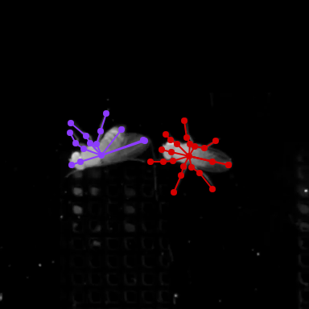
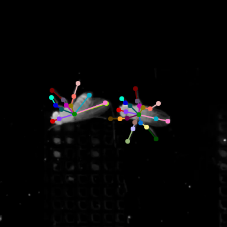
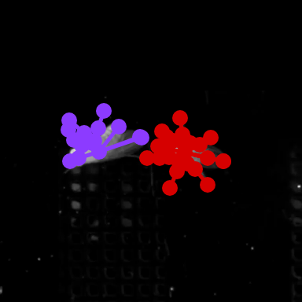
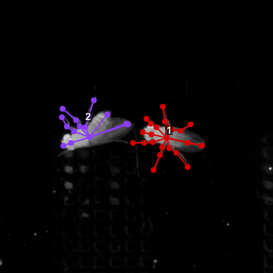
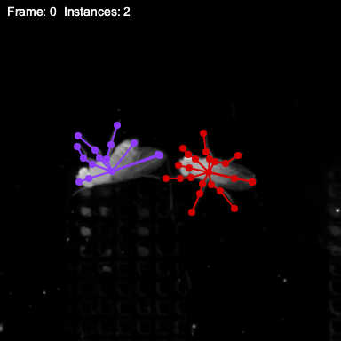

# Rendering

sleap-io provides high-performance pose visualization using [skia-python](https://kyamagu.github.io/skia-python/), a production-quality 2D graphics library.

---

## Quick Start

Render a single frame to a numpy array:

```python
import sleap_io as sio

labels = sio.load_slp("predictions.slp")
img = sio.render_image(labels.labeled_frames[0])
```


Render a full video:

```python
sio.render_video(labels, "output.mp4")
```

This produces an MP4 video file with skeleton overlays on all labeled frames.

---

## Color Schemes

Color scheme determines how poses are colored across instances and frames.

### Color by track

Each tracked animal gets a consistent color across all frames:

```python
img = sio.render_image(lf, color_by="track")
```


### Color by instance

Each animal within a frame gets a unique color (colors may change between frames):

```python
img = sio.render_image(lf, color_by="instance")
```



### Color by node

Each body part gets a unique color (same across all animals):

```python
img = sio.render_image(lf, color_by="node")
```



---

## Color Palettes

### Built-in palettes

9 palettes are included with no additional dependencies.

#### standard

MATLAB default colors (default palette):

```python
img = sio.render_image(lf, color_by="node", palette="standard")
```


#### distinct

High-contrast colors for instances/tracks:

```python
img = sio.render_image(lf, color_by="node", palette="distinct")
```


#### rainbow

Spectrum colors for node types:

```python
img = sio.render_image(lf, color_by="node", palette="rainbow")
```


#### warm

Orange/red tones:

```python
img = sio.render_image(lf, color_by="node", palette="warm")
```


#### cool

Blue/purple tones:

```python
img = sio.render_image(lf, color_by="node", palette="cool")
```


#### pastel

Subtle colors for overlays:

```python
img = sio.render_image(lf, color_by="node", palette="pastel")
```


#### seaborn

Professional look for publications:

```python
img = sio.render_image(lf, color_by="node", palette="seaborn")
```


#### tableau10

Data visualization standard:

```python
img = sio.render_image(lf, color_by="node", palette="tableau10")
```


#### viridis

Perceptually uniform scientific:

```python
img = sio.render_image(lf, color_by="node", palette="viridis")
```


### Colorcet palettes

sleap-io includes [colorcet](https://colorcet.holoviz.org/) palettes:

#### glasbey

256 maximally distinct colors:

```python
img = sio.render_image(lf, color_by="node", palette="glasbey")
```


#### glasbey_hv

High visibility variant:

```python
img = sio.render_image(lf, color_by="node", palette="glasbey_hv")
```


#### glasbey_cool

Cool-toned variant:

```python
img = sio.render_image(lf, color_by="node", palette="glasbey_cool")
```


#### glasbey_warm

Warm-toned variant:

```python
img = sio.render_image(lf, color_by="node", palette="glasbey_warm")
```


### Getting palette colors programmatically

```python
colors = sio.rendering.get_palette("tableau10", 10)
# Returns: [(31, 119, 180), (255, 127, 14), ...]
```

---

## Marker Shapes

Five marker shapes are available for node visualization.

#### circle

Filled circle (default):

```python
img = sio.render_image(lf, marker_shape="circle", marker_size=6.0)
```


#### square

Filled square:

```python
img = sio.render_image(lf, marker_shape="square", marker_size=6.0)
```


#### diamond

Rotated square:

```python
img = sio.render_image(lf, marker_shape="diamond", marker_size=6.0)
```


#### triangle

Upward-pointing triangle:

```python
img = sio.render_image(lf, marker_shape="triangle", marker_size=6.0)
```


#### cross

Plus sign:

```python
img = sio.render_image(lf, marker_shape="cross", marker_size=6.0)
```


---

## Styling Options

### Marker and line sizes

Small markers and thin lines for detailed work:

```python
img = sio.render_image(lf, marker_size=3.0, line_width=1.5)
```


Medium markers and lines:

```python
img = sio.render_image(lf, marker_size=6.0, line_width=3.0)
```


Large markers and thick lines for visibility:

```python
img = sio.render_image(lf, marker_size=10.0, line_width=5.0)
```



### Transparency

Full opacity (default):

```python
img = sio.render_image(lf, alpha=1.0)
```


Semi-transparent overlay:

```python
img = sio.render_image(lf, alpha=0.5)
```


Subtle overlay:

```python
img = sio.render_image(lf, alpha=0.25)
```


### Toggle elements

Both nodes and edges (default):

```python
img = sio.render_image(lf, show_nodes=True, show_edges=True)
```


Edges only:

```python
img = sio.render_image(lf, show_nodes=False, show_edges=True)
```


Nodes only:

```python
img = sio.render_image(lf, show_nodes=True, show_edges=False)
```


---

## Scaling and Cropping

Control output resolution and focus on regions of interest.

### Output scaling

The `scale` parameter resizes the output. Graphics (markers, lines) scale proportionally:

```python
# Full resolution (default)
img = sio.render_image(lf, scale=1.0)

# Half resolution - faster, smaller files
img = sio.render_image(lf, scale=0.5)

# Quarter resolution - quick preview
img = sio.render_image(lf, scale=0.25)
```


### Cropping to a region

Use the `crop` parameter to render a specific region. Bounds are `(x1, y1, x2, y2)` where `(x1, y1)` is the top-left corner and `(x2, y2)` is the bottom-right (exclusive). Origin `(0, 0)` is at the image top-left.

Cropping works for both single images and videos. For videos, the same crop region is applied uniformly to all frames.

**Pixel coordinates** (integer tuple):

```python
import sleap_io as sio

labels = sio.load_slp("predictions.slp")
lf = labels.labeled_frames[0]

# Crop to region (x1, y1, x2, y2) in pixels
img = sio.render_image(lf, crop=(100, 100, 300, 300))

# Same for video rendering
sio.render_video(labels, "cropped.mp4", crop=(100, 100, 300, 300))
```


**Normalized coordinates** (float tuple in [0.0, 1.0]):

```python
# Crop center 50% of the frame
img = sio.render_image(lf, crop=(0.25, 0.25, 0.75, 0.75))

# Crop right half of the frame
img = sio.render_image(lf, crop=(0.5, 0.0, 1.0, 1.0))
```

Detection is type-based: all values must be Python `float` type and in [0.0, 1.0] range. Values outside this range (e.g., `(100.0, 100.0, 300.0, 300.0)`) are treated as pixel coordinates.

### Zoomed crop

Combine cropping with scaling for zoomed-in views:

```python
# Crop a small region and scale up for zoom effect
img = sio.render_image(lf, crop=(140, 120, 240, 220), scale=2.0)
```


---

## Background Control

Control the background when rendering poses. Use `background="video"` (default) to load video frames, or specify a color to render with a solid background.

### Named color

```python
img = sio.render_image(lf, background="black")
```


### RGB tuple

```python
img = sio.render_image(lf, background=(40, 40, 40))
```


### Hex color

```python
img = sio.render_image(lf, background="#1a1a2e")
```


### Palette color

```python
img = sio.render_image(lf, background="tableau10[0]")
```


### Color specification formats

The `background` parameter accepts many formats:

| Format | Example | Description |
|--------|---------|-------------|
| Named color | `"black"`, `"white"`, `"gray"` | Predefined color names |
| Hex (6-digit) | `"#ff8000"` | Standard hex color |
| Hex (3-digit) | `"#f80"` | Shorthand hex |
| RGB int tuple | `(255, 128, 0)` | Values 0-255 |
| RGB float tuple | `(1.0, 0.5, 0.0)` | Values 0.0-1.0 |
| Grayscale int | `40` | Single value 0-255 |
| Grayscale float | `0.15` | Single value 0.0-1.0 |
| Palette index | `"tableau10[0]"` | Color from palette |

Available named colors: `black`, `white`, `red`, `green`, `blue`, `yellow`, `cyan`, `magenta`, `gray`/`grey`, `orange`, `purple`, `pink`, `brown`.

---

## Creating Montages

Render multiple frames and combine them:

```python
import numpy as np
import sleap_io as sio

labels = sio.load_slp("predictions.slp")

frame_indices = [0, 100, 200, 300, 400]
frames = []
for i in frame_indices:
    img = sio.render_image(labels.labeled_frames[i], color_by="track")
    frames.append(img)

montage = np.concatenate(frames, axis=1)
```


---

## Custom Rendering with Callbacks

Callbacks let you add custom graphics. You get direct access to the Skia canvas.

There are three callback types:

| Callback | Context Type | When Called |
|----------|--------------|-------------|
| `pre_render_callback` | [`RenderContext`](#sleap_io.rendering.RenderContext) | Before poses are drawn |
| `post_render_callback` | [`RenderContext`](#sleap_io.rendering.RenderContext) | After all poses are drawn |
| `per_instance_callback` | [`InstanceContext`](#sleap_io.rendering.InstanceContext) | After each instance is drawn |

### Instance labels

Draw track names above each instance:

```python
import skia
from sleap_io.rendering import InstanceContext

def draw_labels(ctx: InstanceContext):
    centroid = ctx.get_centroid()
    if centroid is None:
        return
    cx, cy = ctx.world_to_canvas(*centroid)
    font = skia.Font(skia.Typeface("Arial"), 14)
    label = ctx.track_name or f"Instance {ctx.instance_idx}"
    blob = skia.TextBlob(label, font)
    # Background
    bounds = font.measureText(label)
    bg = skia.Paint(Color=skia.Color4f(0, 0, 0, 0.6))
    ctx.canvas.drawRect(skia.Rect(cx - 2, cy - 18, cx + bounds + 2, cy - 4), bg)
    # Text
    paint = skia.Paint(Color=skia.ColorWHITE, AntiAlias=True)
    ctx.canvas.drawTextBlob(blob, cx, cy - 6, paint)

img = sio.render_image(lf, per_instance_callback=draw_labels)
```



### Bounding boxes

Draw dashed bounding boxes around instances:

```python
import skia
from sleap_io.rendering import InstanceContext

def draw_bbox(ctx: InstanceContext):
    bbox = ctx.get_bbox()
    if bbox is None:
        return
    x1, y1, x2, y2 = bbox
    x1, y1 = ctx.world_to_canvas(x1, y1)
    x2, y2 = ctx.world_to_canvas(x2, y2)
    pad = 8
    rect = skia.Rect(x1 - pad, y1 - pad, x2 + pad, y2 + pad)
    dash = skia.DashPathEffect.Make([6, 3], 0)
    paint = skia.Paint(
        Color=skia.ColorWHITE,
        Style=skia.Paint.kStroke_Style,
        StrokeWidth=2,
        PathEffect=dash,
    )
    ctx.canvas.drawRect(rect, paint)

img = sio.render_image(lf, per_instance_callback=draw_bbox)
```


### Frame info overlay

Add frame number and instance count:

```python
import skia
from sleap_io.rendering import RenderContext

def draw_frame_info(ctx: RenderContext):
    font = skia.Font(skia.Typeface("Arial"), 14)
    text = f"Frame: {ctx.frame_idx}  Instances: {len(ctx.instances)}"
    blob = skia.TextBlob(text, font)
    bg = skia.Paint(Color=skia.Color4f(0, 0, 0, 0.7))
    ctx.canvas.drawRect(skia.Rect(4, 4, 200, 24), bg)
    paint = skia.Paint(Color=skia.ColorWHITE, AntiAlias=True)
    ctx.canvas.drawTextBlob(blob, 8, 18, paint)

img = sio.render_image(lf, post_render_callback=draw_frame_info)
```



### Combining callbacks

```python
from sleap_io.rendering import InstanceContext

def combined_per_instance(ctx: InstanceContext):
    draw_bbox(ctx)
    draw_labels(ctx)

img = sio.render_image(
    lf,
    per_instance_callback=combined_per_instance,
    post_render_callback=draw_frame_info,
)
```


---

## Video Rendering

### Basic video rendering

```python
sio.render_video(labels, "output.mp4")
```

### Render a clip

```python
sio.render_video(labels, "clip.mp4", start=100, end=200)
```

### Quality presets

```python
# Fast preview (0.25x resolution)
sio.render_video(labels, "preview.mp4", preset="preview")

# Draft quality (0.5x resolution)
sio.render_video(labels, "draft.mp4", preset="draft")

# Full quality (default)
sio.render_video(labels, "final.mp4", preset="final")
```

### Encoding options

```python
sio.render_video(
    labels,
    "output.mp4",
    fps=30.0,           # Output frame rate
    crf=18,             # Quality (2-32, lower=better)
    x264_preset="slow", # Encoding speed
)
```

---

## CLI Reference

For CLI usage, see the [CLI Guide](cli.md#sio-render).

```bash
# Basic rendering
sio render -i predictions.slp -o output.mp4

# Fast preview
sio render -i predictions.slp --preset preview

# Single frame to PNG
sio render -i predictions.slp --lf 0 -o frame.png

# Custom styling
sio render -i predictions.slp -o styled.mp4 \
    --color-by track --palette tableau10 --marker-shape diamond
```

---

## API Reference

::: sleap_io.render_video
    options:
      show_root_heading: true
      heading_level: 3

::: sleap_io.render_image
    options:
      show_root_heading: true
      heading_level: 3

::: sleap_io.rendering.get_palette
    options:
      show_root_heading: true
      heading_level: 3

::: sleap_io.rendering.resolve_color
    options:
      show_root_heading: true
      heading_level: 3

::: sleap_io.rendering.RenderContext
    options:
      show_root_heading: true
      heading_level: 3

::: sleap_io.rendering.InstanceContext
    options:
      show_root_heading: true
      heading_level: 3
