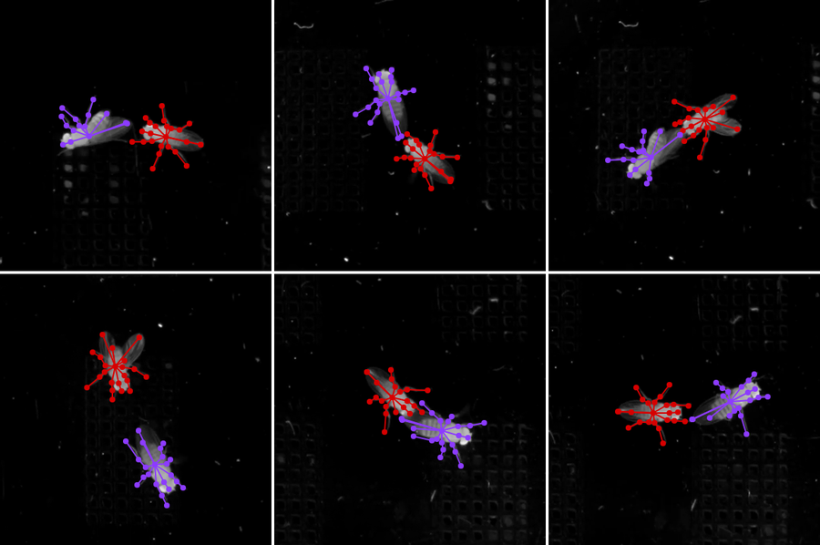
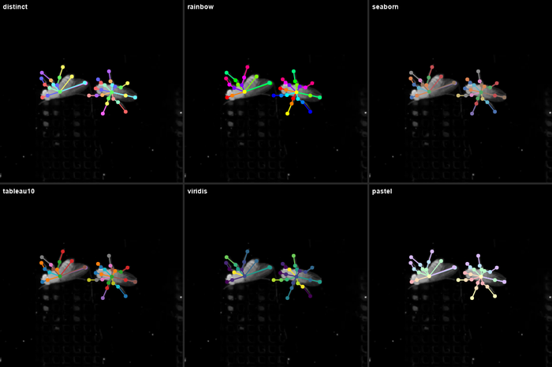
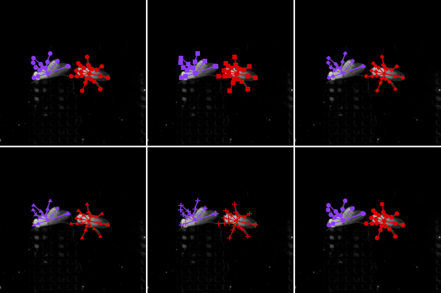
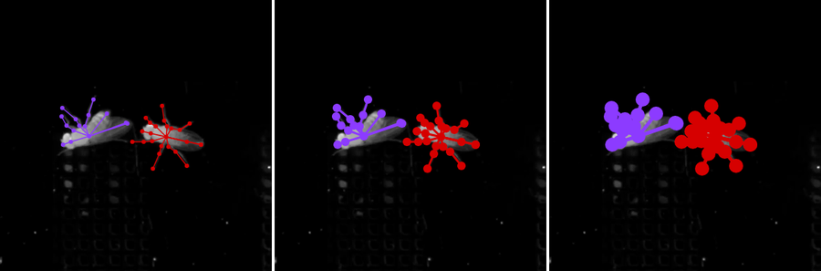
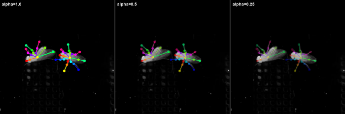
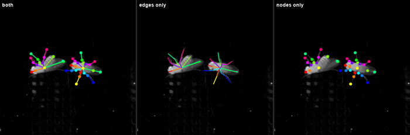

# Rendering

sleap-io provides high-performance pose visualization using [skia-python](https://kyamagu.github.io/skia-python/), a production-quality 2D graphics library. This guide covers all rendering capabilities from quick one-liners to advanced custom overlays.

!!! info "Required dependencies"
    Rendering requires optional dependencies:
    ```bash
    pip install sleap-io[all]        # All optional deps
    pip install sleap-io[rendering]  # Minimal rendering deps only
    ```

---

## Quick Start

{ align=right }

```python
import sleap_io as sio

labels = sio.load_slp("predictions.slp")

# Render full video
labels.render("output.mp4")

# Render single frame to array
img = sio.render_image(labels.labeled_frames[0])

# Save single frame to file
sio.render_image(labels.labeled_frames[0], "frame.png")
```

<div style="clear: both;"></div>

---

## API Overview

### Main Functions

| Function | Description |
|----------|-------------|
| [`sio.render_video()`](#render-video) | Render video with pose overlays |
| [`sio.render_image()`](#render-image) | Render single frame |
| [`Labels.render()`](#labelsrender) | Convenience method on Labels |

### Color Options

| Option | Description |
|--------|-------------|
| `color_by` | Scheme: `"auto"`, `"track"`, `"instance"`, `"node"` |
| `palette` | Color palette name |

### Appearance Options

| Option | Default | Description |
|--------|---------|-------------|
| `marker_shape` | `"circle"` | Node marker shape |
| `marker_size` | `4.0` | Node radius in pixels |
| `line_width` | `2.0` | Edge line width |
| `alpha` | `1.0` | Transparency (0.0-1.0) |
| `show_nodes` | `True` | Draw node markers |
| `show_edges` | `True` | Draw skeleton edges |

---

## Rendering Patterns

### Pattern 1: In-memory rendering

Render frames to numpy arrays for display, further processing, or custom pipelines.

```python
import sleap_io as sio
import matplotlib.pyplot as plt

labels = sio.load_slp("predictions.slp")

# Render single frame to array
img = sio.render_image(labels.labeled_frames[0])
print(img.shape)  # (H, W, 3) uint8

# Display with matplotlib
plt.imshow(img)
plt.axis("off")
plt.savefig("figure.png", dpi=300, bbox_inches="tight")
```

### Pattern 2: Render to disk

Save rendered output directly to image or video files.

```python
import sleap_io as sio

labels = sio.load_slp("predictions.slp")

# Save single frame to PNG
sio.render_image(labels, lf_ind=0, save_path="frame_0.png")

# Or use LabeledFrame directly
sio.render_image(labels.labeled_frames[42], "frame_42.png")

# Render video to MP4
sio.render_video(labels, "output.mp4")
```

### Pattern 3: Render specific video frame

Render by video frame index rather than labeled frame index.

```python
import sleap_io as sio

labels = sio.load_slp("predictions.slp")

# Render video frame 100 from video 0
sio.render_image(labels, video=0, frame_idx=100, save_path="frame_100.png")

# Or get as array
img = sio.render_image(labels, video=0, frame_idx=100)
```

### Pattern 4: Batch render multiple frames

{ align=right }

Render many frames efficiently for creating figures or montages.

```python
import sleap_io as sio
import numpy as np

labels = sio.load_slp("predictions.slp")

# Render frames 0, 10, 20, ... 90
frames = []
for i in range(0, 100, 10):
    if i < len(labels.labeled_frames):
        img = sio.render_image(labels, lf_ind=i)
        frames.append(img)

# Stack into horizontal strip
montage = np.concatenate(frames, axis=1)
```

<div style="clear: both;"></div>

### Pattern 5: Video clip rendering

Render a subset of frames to video.

```python
import sleap_io as sio

labels = sio.load_slp("predictions.slp")

# Render frames 100-200
sio.render_video(labels, "clip.mp4", start=100, end=200)

# Or render specific frame indices
sio.render_video(labels, "selected.mp4", frame_inds=[0, 50, 100, 150])
```

### Pattern 6: Include unlabeled frames

Render all frames in a range, not just those with predictions.

```python
import sleap_io as sio

labels = sio.load_slp("predictions.slp")

# Render all video frames, showing blank poses where no predictions exist
sio.render_video(labels, "full_video.mp4", include_unlabeled=True)

# Combine with frame range
sio.render_video(labels, "clip.mp4", start=0, end=500, include_unlabeled=True)
```

By default, only frames with predictions are rendered. With `include_unlabeled=True`, the video includes all frames in the range—frames without predictions show just the video frame without skeleton overlays.

---

## Color Schemes

Color scheme determines how poses are colored across instances and frames.

### Auto mode (default)

```python
sio.render_video(labels, "output.mp4", color_by="auto")
```

Auto mode uses these rules:

- If tracks available → color by track (consistent identity across frames)
- If single image → color by instance (distinguishes animals)
- If video without tracks → color by node (prevents flicker)

### Color by track

{ align=right }

```python
sio.render_video(
    labels,
    "by_track.mp4",
    color_by="track"
)
```

Each tracked animal gets a consistent color across all frames.

**Best for:** Tracked data where you want to follow specific animals. Each animal maintains its color identity even as it moves.

<div style="clear: both;"></div>

### Color by instance

{ align=right }

```python
sio.render_video(
    labels,
    "by_instance.mp4",
    color_by="instance"
)
```

Each animal within a frame gets a unique color, but colors may change between frames.

**Best for:** Single-frame renders or untracked data.

<div style="clear: both;"></div>

### Color by node

{ align=right }

```python
sio.render_video(
    labels,
    "by_node.mp4",
    color_by="node"
)
```

Each body part gets a unique color (same for all animals).

**Best for:** Highlighting skeleton structure or comparing body parts across animals.

<div style="clear: both;"></div>

---

## Color Palettes

### Built-in palettes

8 palettes are included with no additional dependencies:



| Palette | Colors | Description |
|---------|--------|-------------|
| `distinct` | 10 | High-contrast colors for instances/tracks |
| `rainbow` | 256 | Spectrum colors for node types |
| `warm` | 256 | Orange/red tones |
| `cool` | 256 | Blue/purple tones |
| `pastel` | 10 | Subtle colors for overlays |
| `seaborn` | 10 | Professional look for publications |
| `tableau10` | 10 | Data visualization standard |
| `viridis` | 256 | Perceptually uniform scientific |

```python
# Use a built-in palette
sio.render_video(labels, "output.mp4", palette="tableau10")
sio.render_video(labels, "output.mp4", palette="rainbow")
```

### Colorcet palettes

With the `[all]` or `[rendering]` extras, you get access to [colorcet](https://colorcet.holoviz.org/)'s expanded palettes:


| Palette | Colors | Description |
|---------|--------|-------------|
| `glasbey` | 256 | Maximally distinct colors |
| `glasbey_hv` | 256 | High visibility variant |
| `glasbey_cool` | 256 | Cool-toned variant |
| `glasbey_warm` | 256 | Warm-toned variant |

```python
# Great for many tracked instances
sio.render_video(labels, "output.mp4", palette="glasbey")

# High visibility for dark backgrounds
sio.render_video(labels, "output.mp4", palette="glasbey_hv")
```

### Getting palette colors programmatically

```python
import sleap_io as sio

# Get 10 colors from a palette
colors = sio.rendering.get_palette("tableau10", 10)
# Returns: [(31, 119, 180), (255, 127, 14), ...]

# Palettes cycle if you request more colors than they have
colors = sio.rendering.get_palette("distinct", 20)  # Repeats the 10 colors
```

---

## Marker Shapes

Five marker shapes are available for node visualization:



| Shape | Description |
|-------|-------------|
| `circle` | Filled circle (default) |
| `square` | Filled square |
| `diamond` | Rotated square |
| `triangle` | Upward-pointing triangle |
| `cross` | Plus sign |

```python
sio.render_video(labels, "output.mp4", marker_shape="circle")
sio.render_video(labels, "output.mp4", marker_shape="diamond")
sio.render_video(labels, "output.mp4", marker_shape="cross")
```

The `cross` and `diamond` shapes can improve visibility on cluttered backgrounds.

---

## Styling Options

### Marker and line sizes



```python
# Small (detailed work)
sio.render_video(labels, "small.mp4", marker_size=3.0, line_width=1.5)

# Medium (default-ish)
sio.render_video(labels, "medium.mp4", marker_size=6.0, line_width=3.0)

# Large (visibility)
sio.render_video(labels, "large.mp4", marker_size=10.0, line_width=5.0)
```

### Transparency



```python
# Semi-transparent overlay
sio.render_video(labels, "translucent.mp4", alpha=0.5)

# Very subtle overlay
sio.render_video(labels, "subtle.mp4", alpha=0.25)
```

Lower alpha values let the underlying video show through.

### Toggle elements



```python
# Edges only (no node markers)
sio.render_video(labels, "edges_only.mp4", show_nodes=False)

# Nodes only (no skeleton edges)
sio.render_video(labels, "nodes_only.mp4", show_edges=False)
```

---

## Quality and Performance

### Quality presets

| Preset | Scale | Use case |
|--------|-------|----------|
| `preview` | 0.25x | Quick checks, scrubbing |
| `draft` | 0.5x | Review, iteration |
| `final` | 1.0x | Publication, sharing |

```python
# Fast preview for checking predictions
sio.render_video(labels, "preview.mp4", preset="preview")

# Full quality for publication
sio.render_video(labels, "final.mp4", preset="final")

# Custom scale
sio.render_video(labels, "output.mp4", scale=0.75)
```

The `preview` preset outputs a video at 1/4 resolution, rendering ~9x faster.

### Performance characteristics

Typical rendering speeds (measured on 1024x1024 frames with 13 nodes):

| Operation | Speed | Notes |
|-----------|-------|-------|
| Skia rendering | ~93 FPS | Vector graphics are fast |
| Video I/O | ~5 FPS | Bottleneck is video decoding |
| Preview (0.25x) | ~15 FPS | Reduced resolution helps |

**Tips for faster rendering:**

1. Use `preset="preview"` for quick checks
2. Use `start`/`end` to render clips instead of full videos
3. For maximum speed, pre-extract frames to image sequences

### Video encoding options

```python
sio.render_video(
    labels,
    "output.mp4",
    fps=30.0,           # Output frame rate
    crf=18,             # Quality (2-32, lower=better, default 25)
    x264_preset="slow", # Encoding speed (ultrafast to slow)
)
```

---

## Custom Rendering with Callbacks

Callbacks let you add custom graphics like labels, bounding boxes, or annotations. You get direct access to the Skia canvas for arbitrary drawing.

### Callback types

| Callback | When called | Use case |
|----------|-------------|----------|
| `pre_render_callback` | Before poses drawn | Background layers, grids, ROIs |
| `post_render_callback` | After all poses | Frame info, legends, watermarks |
| `per_instance_callback` | After each instance | Labels, bounding boxes, badges |

### Context objects

Callbacks receive context objects with useful information:

**`RenderContext`** (frame-level):
```python
ctx.canvas          # Skia canvas for drawing
ctx.frame_idx       # Current frame index
ctx.frame_size      # (width, height) tuple
ctx.instances       # List of point arrays
ctx.skeleton_edges  # Edge connectivity
ctx.node_names      # Node name list
ctx.scale           # Current scale factor
ctx.offset          # Current offset (x, y)
ctx.world_to_canvas(x, y)  # Coordinate transform
```

**`InstanceContext`** (instance-level):
```python
ctx.canvas          # Skia canvas for drawing
ctx.instance_idx    # Index in frame
ctx.points          # (n_nodes, 2) array
ctx.track_name      # Track name string
ctx.confidence      # Instance confidence score
ctx.get_centroid()  # Mean of valid points
ctx.get_bbox()      # (x1, y1, x2, y2) bounding box
ctx.world_to_canvas(x, y)  # Coordinate transform
```

### Example: Instance labels

{ align=right }

```python
import sleap_io as sio
import skia

def draw_labels(ctx):
    centroid = ctx.get_centroid()
    if centroid is None:
        return

    cx, cy = ctx.world_to_canvas(*centroid)
    font = skia.Font(skia.Typeface("Arial"), 14)
    label = ctx.track_name or f"Instance {ctx.instance_idx}"
    blob = skia.TextBlob(label, font)

    paint = skia.Paint(Color=skia.ColorWHITE)
    ctx.canvas.drawTextBlob(blob, cx, cy - 20, paint)

labels = sio.load_slp("predictions.slp")
sio.render_video(
    labels, "labeled.mp4",
    per_instance_callback=draw_labels
)
```

<div style="clear: both;"></div>

### Example: Bounding boxes

{ align=right }

```python
import sleap_io as sio
import skia

def draw_bbox(ctx):
    bbox = ctx.get_bbox()
    if bbox is None:
        return

    x1, y1, x2, y2 = bbox
    x1, y1 = ctx.world_to_canvas(x1, y1)
    x2, y2 = ctx.world_to_canvas(x2, y2)

    pad = 8
    rect = skia.Rect(x1 - pad, y1 - pad, x2 + pad, y2 + pad)

    dash = skia.DashPathEffect.Make([6, 3], 0)
    paint = skia.Paint(
        Color=skia.ColorWHITE,
        Style=skia.Paint.kStroke_Style,
        StrokeWidth=2,
        PathEffect=dash,
    )
    ctx.canvas.drawRect(rect, paint)

sio.render_video(
    labels, "boxes.mp4",
    per_instance_callback=draw_bbox
)
```

<div style="clear: both;"></div>

### Example: Frame info overlay

{ align=right }

```python
import sleap_io as sio
import skia

def draw_frame_info(ctx):
    font = skia.Font(skia.Typeface("Arial"), 14)
    text = f"Frame: {ctx.frame_idx}"
    blob = skia.TextBlob(text, font)

    # Background
    bg = skia.Paint(Color=skia.Color4f(0, 0, 0, 0.7))
    ctx.canvas.drawRect(skia.Rect(4, 4, 100, 24), bg)

    # Text
    paint = skia.Paint(Color=skia.ColorWHITE)
    ctx.canvas.drawTextBlob(blob, 8, 18, paint)

sio.render_video(
    labels, "info.mp4",
    post_render_callback=draw_frame_info
)
```

<div style="clear: both;"></div>

### Combining callbacks

{ align=right }

```python
def combined(ctx):
    draw_bbox(ctx)
    draw_labels(ctx)

sio.render_video(
    labels,
    "annotated.mp4",
    post_render_callback=draw_frame_info,
    per_instance_callback=combined,
)
```

Callbacks are applied in order: pre-render, skeleton drawing, per-instance, then post-render.

<div style="clear: both;"></div>

### Skia drawing reference

Common Skia operations available in callbacks:

| Feature | Method |
|---------|--------|
| Text | `canvas.drawTextBlob(blob, x, y, paint)` |
| Circles | `canvas.drawCircle(x, y, radius, paint)` |
| Lines | `canvas.drawLine(x1, y1, x2, y2, paint)` |
| Rectangles | `canvas.drawRect(rect, paint)` |
| Rounded rects | `canvas.drawRoundRect(rect, rx, ry, paint)` |
| Paths/Polygons | `canvas.drawPath(path, paint)` |
| Images | `canvas.drawImage(image, x, y)` |

---

## Handling Missing Videos

When video files are unavailable, you can still render with fallback options:

### Fallback solid color background

{ align=right }

```python
sio.render_video(
    labels,
    "output.mp4",
    require_video=False,
    fallback_color=(128, 128, 128),
)

# Single frame with fallback
sio.render_image(
    labels.labeled_frames[0],
    "frame.png",
    require_video=False,
    fallback_color=(0, 0, 0),
)
```

Useful for visualizing predictions when the original video is missing.

<div style="clear: both;"></div>

### Custom background image

```python
import numpy as np
import sleap_io as sio

labels = sio.load_slp("predictions.slp")
lf = labels.labeled_frames[0]

# Create custom background
bg = np.zeros((1024, 1024, 3), dtype=np.uint8)
bg[:] = (30, 30, 30)

# Render with custom background
img = sio.render_image(lf, image=bg)
```

---

## CLI Reference

For CLI usage, see the [CLI Guide](cli.md#sio-render---render-pose-videos-and-images). Quick reference:

```bash
# Basic rendering
sio render -i predictions.slp -o output.mp4

# Fast preview
sio render -i predictions.slp --preset preview

# Single frame
sio render -i predictions.slp --lf 0 -o frame.png

# Custom styling
sio render -i predictions.slp -o styled.mp4 \
    --color-by track \
    --palette tableau10 \
    --marker-shape diamond

# Render a clip
sio render -i predictions.slp -o clip.mp4 --start 100 --end 200
```

---

## API Reference

::: sleap_io.render_video
    options:
      show_root_heading: true
      heading_level: 3

::: sleap_io.render_image
    options:
      show_root_heading: true
      heading_level: 3

::: sleap_io.rendering.get_palette
    options:
      show_root_heading: true
      heading_level: 3

::: sleap_io.rendering.RenderContext
    options:
      show_root_heading: true
      heading_level: 3

::: sleap_io.rendering.InstanceContext
    options:
      show_root_heading: true
      heading_level: 3
